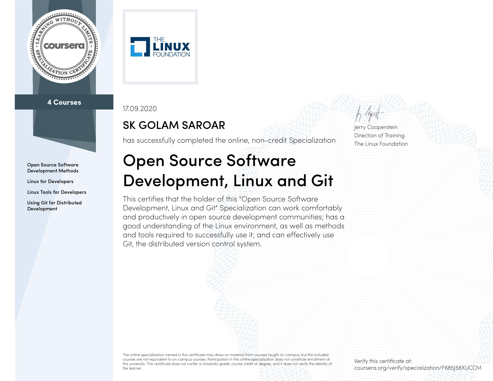

## Open Source Software Development, Linux and Git Specialization on Coursera

This repository contains notes from the Coursera specialization [Open Source Software Development, Linux and Git](https://www.coursera.org/specializations/oss-development-linux-git).

This specialization gives the learners a strong foundation for working comfortably and productively in open source development communities. By completing the specialization, a learner is expected to have a better understanding of the Linux environment, as well as methods and tools required to successfully use it, and know how to use git, the distributed version control system.

There are four courses in the Specialization.

1. **Open Source Software Development Methods**:  
- define what open source software is 
- the history of open source software 
- what benefits it has provided to the world’s technology infrastructure 
- how to work in open source projects productively and gain benefits from it 
- understand the advantages 
- collaboration best practices 
- how to encourage diversity in open source projects 
- the different licensing models that are available 
- methods that are commonly used, such as Continuous Integration 
- use of GitHub and other hosting providers as a central meeting place for open source projects 
- some examples of successful open source projects.

2. **Linux for Developers**: Learn what it’s like to work on Linux system, and get a good understanding of the essential skills you need when you work on a daily basis with Linux systems.

- What Linux is
- Linux history
- How to separate the kernel from the entire operating system
- Making contributions to the kernel
- Graphical system, and how it works
- Working at the command line
- Filesystem layout, partitions
- Monitoring utilities

3. **Linux Tools for Developers**: This course is a continuation of the previous course, and will focus on teaching students how to work with tools they need to do their everyday work.

- introducing you to numerous essential command line tools that are used daily
- focus on bash scripting - you will learn how to construct scripts and how to do very complicated tasks in an automated way 
- files and filesystems 
- compiling programs in Linux, using gcc and other compilers 
- using libraries of different types. 
- building packages out of software in Linux.

4. **Using Git for Distributed Development**: This course gives students the opportunity to learn how to use git efficiently and make contributions in a relatively short amount of time.

- How to install git
- How to initialize a repository
- How to make changes in a repository
- How to make changes in repositories available to others
- How to acquire changes made by other individuals
- How to find errors in your work and go back to earlier states of yoru projects
- How to make commits, diffs, merges, rebases.

Here is my certificate from the specialization.

